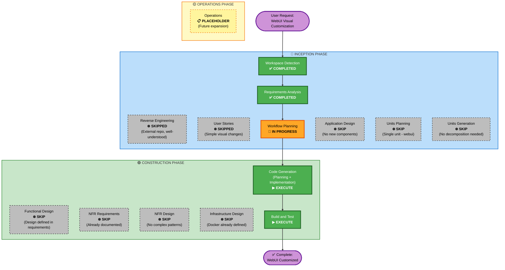

# Execution Plan - WebUI Visual Customization

**Proyecto**: ActivityWatch WebUI - Branding Anáhuac Mayab  
**Fecha**: 2026-05-19T00:30:00Z  
**Tipo**: UI/UX Enhancement (Brownfield - External Component)  
**Complejidad**: Moderada  
**Riesgo**: Bajo

---

## 1. Detailed Analysis Summary

### 1.1 Transformation Scope

**Transformation Type**: Single Component Modification (Visual Only)  
**Component**: aw-webui (external repository)  
**Primary Changes**: 
- Logo replacement (assets)
- Home page redesign (Vue components + CSS)
- Global color palette application
- Typography implementation
- Border radius standardization

**Related Components**:
- `Dockerfile.webui` - Build process modification (use local source instead of git clone)
- `docker-compose.yml` - No changes required (already configured)

**NOT Affected**:
- aw-server (Rust backend)
- aw-datastore (PostgreSQL layer)
- postgresql (database)
- Networking, monitoring, or infrastructure

---

### 1.2 Change Impact Assessment

#### User-Facing Changes
**YES** - High visibility, low functional impact
- Logo appears in header (all pages) and home page
- Home page displays new branding and content
- Visual changes only - all functionality preserved
- Users will see Anáhuac Mayab branding instead of ActivityWatch default

#### Structural Changes
**NO** - No architectural changes
- Vue component structure remains the same
- Component hierarchy unchanged
- No new services or modules
- No routing or navigation changes

#### Data Model Changes
**NO** - No data changes
- No database schema modifications
- No API data structures affected
- No state management changes
- Purely presentational layer changes

#### API Changes
**NO** - No API modifications
- All backend APIs remain unchanged
- No new endpoints required
- No changes to request/response formats
- Frontend-backend contract intact

#### NFR Impact
**Minimal** - Performance neutral or positive
- Performance: Logo optimization may improve load time
- Security: No new attack surface
- Scalability: No impact
- Maintainability: Slightly increased (custom fork of aw-webui)

---

### 1.3 Component Relationships

**Component Dependency Graph**:
```
aw-webui (MODIFIED)
   ├── Static Assets
   │   └── Logo files (NEW: Anáhuac logo)
   ├── Vue Components
   │   ├── Header.vue (MODIFIED: logo reference)
   │   └── Home.vue (MODIFIED: complete redesign)
   ├── CSS/SCSS
   │   ├── variables.scss (MODIFIED: colors, typography, border-radius)
   │   └── home.scss (MODIFIED: home page styles)
   └── Build Process
       └── Dockerfile.webui (MODIFIED: use local source)

Dependencies (UNCHANGED):
   ├── aw-server (NO CHANGES)
   ├── postgresql (NO CHANGES)
   └── docker-compose.yml (NO CHANGES - already configured)
```

**Change Classification**:
- **aw-webui**: Major visual change, Minor technical change
- **Dockerfile.webui**: Minor modification (change source location)
- **Other components**: No changes

---

### 1.4 Risk Assessment

**Overall Risk Level**: **LOW** ✅

**Risk Factors**:
1. **Technical Risk**: LOW
   - Only frontend changes (CSS, assets, Vue templates)
   - No backend or database changes
   - Easy to rollback (revert to original Dockerfile.webui)

2. **Integration Risk**: LOW
   - aw-webui already integrated via Docker Compose
   - No API contract changes
   - No new service dependencies

3. **Performance Risk**: VERY LOW
   - CSS changes are negligible performance impact
   - Logo conversion may improve performance (optimize file size)
   - No new network requests

4. **Operational Risk**: LOW
   - Docker build process well-established
   - Can test locally before production
   - Fallback to original webui readily available

**Rollback Complexity**: EASY
- Revert Dockerfile.webui to clone from GitHub
- Remove local aw-webui/ directory
- Rebuild Docker image

**Testing Complexity**: SIMPLE
- Visual verification (manual inspection)
- Navigation testing (click logo, navigate from home)
- Responsive testing (desktop, tablet, mobile)
- Browser compatibility testing
- Docker build verification

---

## 2. Workflow Visualization



---

## 3. Phases to Execute

### 🔵 INCEPTION PHASE

#### ✅ Completed Stages

- [x] **Workspace Detection** - COMPLETED (2026-05-19)
  - Brownfield project identified
  - External aw-webui repository analyzed
  - Local workspace structure documented

- [x] **Reverse Engineering** - SKIPPED
  - **Rationale**: aw-webui is external repository with well-known Vue.js structure
  - **Alternative**: Will analyze structure after cloning in Code Generation phase

- [x] **Requirements Analysis** - COMPLETED (2026-05-19)
  - 12 questions answered by user
  - Complete design specifications documented
  - Home page content approved
  - Comprehensive requirements-webui.md created

- [x] **User Stories** - SKIPPED
  - **Rationale**: Simple visual changes with no user flow impact
  - **Justification**: No multiple personas, no complex acceptance criteria needed

- [x] **Workflow Planning** - IN PROGRESS (Current)
  - Creating execution plan
  - Determining phases to execute/skip

#### ⊗ Stages to Skip

- [ ] **Application Design** - SKIP
  - **Rationale**: No new components or services needed
  - **Justification**: Modifying existing Vue components (Header, Home) only
  - **Design sufficiently defined in**: requirements-webui.md + design-specifications.md

- [ ] **Units Planning** - SKIP
  - **Rationale**: Single logical unit of work (aw-webui customization)
  - **Justification**: All changes are tightly coupled in one component
  - **No decomposition needed**: Cannot split visual branding across units

- [ ] **Units Generation** - SKIP
  - **Rationale**: No units planned (see Units Planning rationale)

---

### 🟢 CONSTRUCTION PHASE

#### ⊗ Stages to Skip

- [ ] **Functional Design** - SKIP
  - **Rationale**: Design fully specified in requirements-webui.md
  - **Justification**: 
    - Logo specifications: Complete (file, dimensions, locations)
    - Home page layout: Complete (wireframe, content, spacing)
    - Color palette: Complete (15 colors with hex codes)
    - Typography: Complete (6 element specifications)
    - Border radius: Complete (3 sizes with usage)
  - **No additional design artifacts needed**

- [ ] **NFR Requirements Assessment** - SKIP
  - **Rationale**: NFR requirements already documented in requirements-webui.md
  - **Documented NFRs**:
    - NFR-1: Visual Compatibility
    - NFR-2: Functionality Preserved
    - NFR-3: Performance (< 2s load time)
    - NFR-4: Responsive Design (desktop, tablet, mobile)
  - **No new assessment needed**

- [ ] **NFR Design** - SKIP
  - **Rationale**: No complex NFR patterns required
  - **Justification**: 
    - Performance: Standard CSS optimization (minification)
    - Security: No new attack surface
    - Scalability: Frontend changes don't affect scalability
  - **Standard practices sufficient**

- [ ] **Infrastructure Design** - SKIP
  - **Rationale**: Docker infrastructure already defined and validated
  - **Existing infrastructure**:
    - Dockerfile.webui exists (needs minor modification only)
    - docker-compose.yml configured for aw-webui
    - Networking, volumes, healthchecks already in place
  - **Only change needed**: Update Dockerfile.webui to use local source

#### ▶ Stages to Execute

- [ ] **Code Generation** - **EXECUTE** (ALWAYS)
  - **Part 1: Planning** - Create detailed implementation plan with checkboxes
  - **Part 2: Generation** - Execute approved plan
  - **Scope**:
    1. Clone aw-webui repository to local workspace
    2. Convert logo JPG → PNG with transparency
    3. Replace logo files in aw-webui/src/assets/
    4. Create CSS variables (colors, typography, border-radius)
    5. Import Inter font from Google Fonts
    6. Modify Header.vue (logo references)
    7. Redesign Home.vue (complete component rewrite)
    8. Create/update home.scss (styling)
    9. Update Dockerfile.webui (use local source)
    10. Document changes in aw-webui/README-CUSTOMIZATION.md

- [ ] **Build and Test** - **EXECUTE** (ALWAYS)
  - **Scope**:
    1. Local npm build test (npm run build)
    2. Docker image build (docker compose build aw-webui)
    3. Docker Compose integration test
    4. Visual verification (logo, home page, colors, fonts)
    5. Functional testing (navigation, links, buttons)
    6. Responsive testing (desktop, tablet, mobile)
    7. Browser compatibility (Chrome, Firefox, Safari, Edge)
    8. Performance verification (< 2s load time)
    9. Documentation review

---

### 🟡 OPERATIONS PHASE

- [ ] **Operations** - PLACEHOLDER
  - **Status**: Future expansion
  - **Current State**: Build and test covers operational validation
  - **Future Scope**: Monitoring dashboards, deployment automation

---

## 4. Implementation Sequence

### Phase 1: Preparation (5-10 min)
1. ✅ Clone aw-webui repository
2. ✅ Analyze actual file structure
3. ✅ Verify Vue.js version and build tools

### Phase 2: Asset Preparation (10-15 min)
4. ✅ Convert logo JPG → PNG (with transparency)
5. ✅ Optimize logo file size
6. ✅ Create multiple sizes if needed (header vs home)

### Phase 3: Code Implementation (30-45 min)
7. ✅ Create CSS variables file
8. ✅ Import Inter font
9. ✅ Modify Header.vue
10. ✅ Redesign Home.vue
11. ✅ Create/update stylesheets
12. ✅ Update Dockerfile.webui

### Phase 4: Testing (20-30 min)
13. ✅ Local build test
14. ✅ Docker build
15. ✅ Visual verification
16. ✅ Functional testing
17. ✅ Responsive testing

### Phase 5: Documentation (10 min)
18. ✅ Document customizations
19. ✅ Update README files

**Total Estimated Time**: 75-110 minutes (1.25-1.75 hours)

---

## 5. Module Update Strategy

**Update Approach**: Single Module (aw-webui only)

**No Multi-Module Coordination Required**:
- aw-webui is independent frontend module
- No shared interfaces with backend
- No versioning dependencies
- No API contract changes

**Isolated Change**:
- Backend (aw-server, aw-datastore) completely unaffected
- Database (postgresql) unaffected
- Can test aw-webui independently

**Deployment Order**: N/A (single module)

**Rollback Strategy**: Simple
- Revert Dockerfile.webui to git clone approach
- Remove local aw-webui/ directory
- Rebuild Docker image

---

## 6. Success Criteria

### 6.1 Primary Goals

1. ✅ **Logo Replacement**: Anáhuac Mayab logo visible in header and home page
2. ✅ **Home Page Redesign**: New content and layout implemented
3. ✅ **Branding Applied**: Anáhuac color palette (#FF5900) applied
4. ✅ **Functionality Preserved**: All existing features work without changes

### 6.2 Key Deliverables

**Code Artifacts**:
- [ ] Customized aw-webui/ directory with all modifications
- [ ] Updated Dockerfile.webui
- [ ] Converted logo files (PNG format)
- [ ] CSS variables file (colors, typography, border-radius)
- [ ] Modified Vue components (Header.vue, Home.vue)

**Documentation**:
- [ ] aw-webui/README-CUSTOMIZATION.md (customization guide)
- [ ] Implementation summary document
- [ ] Build and test results

**Validated Build**:
- [ ] Docker image builds successfully
- [ ] aw-webui service starts and passes healthcheck
- [ ] Integration with aw-server validated

### 6.3 Quality Gates

**Build Quality**:
- [ ] `npm run build` executes without errors
- [ ] No console errors or warnings
- [ ] Docker image size reasonable (< 100 MB)

**Visual Quality**:
- [ ] Logo visible and clear (no distortion)
- [ ] Home page matches approved layout
- [ ] Colors match Anáhuac palette exactly
- [ ] Typography renders correctly (Inter font)
- [ ] Border radius applied consistently

**Functional Quality**:
- [ ] Logo clickable (if applicable)
- [ ] Home page button functional
- [ ] Navigation to other pages works
- [ ] No broken links or errors

**Performance Quality**:
- [ ] Home page loads in < 2 seconds
- [ ] No layout shift during load
- [ ] Logo loads without visible delay

**Compatibility Quality**:
- [ ] Chrome 90+ renders correctly
- [ ] Firefox 88+ renders correctly
- [ ] Safari 14+ renders correctly
- [ ] Edge 90+ renders correctly
- [ ] Responsive on desktop (1920x1080, 1366x768)
- [ ] Responsive on tablet (768x1024)
- [ ] Responsive on mobile (375x667, 414x896)

---

## 7. Risk Mitigation Plan

### Risk 1: aw-webui Structure Different Than Expected
**Mitigation**:
- Analyze actual structure immediately after cloning
- Adapt implementation plan based on findings
- Document actual structure for future reference

### Risk 2: Logo Conversion Quality Issues
**Mitigation**:
- Use high-quality conversion tools
- Verify transparency and resolution
- Have multiple logo variants available (6 files in assets/)
- Test logo on different backgrounds

### Risk 3: CSS Conflicts with Existing Styles
**Mitigation**:
- Use CSS variables in :root for easy overrides
- Test specificity carefully
- Use browser dev tools to debug conflicts
- Apply !important only as last resort

### Risk 4: Docker Build Fails
**Mitigation**:
- Test npm build locally first
- Verify all files are copied in Dockerfile
- Check Docker context path
- Keep backup of original Dockerfile.webui

### Risk 5: Font Loading Failures
**Mitigation**:
- Use Google Fonts with preconnect
- Implement proper fallbacks (Segoe UI, sans-serif)
- Consider self-hosting fonts if needed
- Test with network throttling

---

## 8. Adaptive Depth Notes

**This project uses MINIMAL depth** for most stages:
- **Requirements**: Comprehensive (already executed)
- **Design**: Minimal (defined in requirements, no separate design doc needed)
- **Code Generation**: Standard (detailed plan + implementation)
- **Testing**: Standard (comprehensive test suite)

**Rationale for Minimal Design Stages**:
- Changes are well-understood (visual only)
- Requirements document is comprehensive and detailed
- No complex algorithms or business logic
- No data model or API changes
- Standard frontend development practices apply

---

## 9. Execution Summary

### Stages Overview
- **Total Stages in Workflow**: 16 stages
- **Stages to Execute**: 4 stages (Workspace Detection, Requirements Analysis, Workflow Planning, Code Generation, Build and Test)
- **Stages to Skip**: 12 stages (with clear rationales)

### Why This is Efficient
1. **No Over-Engineering**: Skipping design stages that don't add value
2. **Focus on Implementation**: Jumping to code generation with clear requirements
3. **Comprehensive Requirements**: Design specs already captured in detail
4. **Low Risk**: Simple changes don't warrant complex planning
5. **Fast Iteration**: Can implement and validate quickly

### Why This is Safe
1. **Clear Requirements**: Complete specifications documented
2. **User Approval**: Content and design approved by user
3. **Easy Rollback**: Can revert to original webui quickly
4. **Isolated Change**: No impact on backend or database
5. **Comprehensive Testing**: Full test suite planned

---

## 10. Next Steps

### Immediate Action (After User Approval)
1. **User reviews and approves this execution plan**
2. **Proceed directly to Code Generation phase**
3. **Part 1: Create detailed implementation plan (25-30 steps)**
4. **User approves implementation plan**
5. **Part 2: Execute implementation plan**

### No Additional Planning Needed
- ✅ Requirements: Complete
- ✅ Design: Sufficient detail in requirements
- ✅ Scope: Clear and limited
- ✅ Risks: Identified and mitigated

### Ready to Start Implementation
- All prerequisites met
- Clear success criteria defined
- Risk mitigation plans in place
- User expectations aligned

---

**Document created**: 2026-05-19T00:35:00Z  
**Status**: ⏳ **Awaiting User Approval**  
**Next Action**: User must approve execution plan to proceed to Code Generation

---

## 11. Execution Plan Approval

**Please confirm**:
1. ✅ Do you approve skipping the design stages (Application Design, Functional Design, NFR Design, Infrastructure Design)?
2. ✅ Do you approve proceeding directly to Code Generation after this approval?
3. ✅ Do you approve the success criteria and quality gates defined above?

**To proceed, respond with**: "Aprobar plan" or "Approve execution plan"
