# Execution Plan - ActivityWatch PostgreSQL Migration & Docker Deployment

**Version**: 1.0  
**Date**: 2026-05-18  
**Status**: Planning Phase

---

## 1. Detailed Scope & Impact Analysis

### 1.1 Transformation Scope

**Transformation Type**: Multi-component Database Migration + Infrastructure Transformation

**Primary Changes**:
- Database abstraction layer: SQLite → PostgreSQL
- Network configuration: Localhost-only → Multi-interface binding
- Deployment model: Single-process executable → Docker containerized stack

**Related Components Affected**:
- ✏️ **aw-datastore** (Primary) - Complete database layer refactoring
- ✏️ **aw-server** (Secondary) - Configuration changes for DB connection & network binding
- ✏️ **aw-webui** (Secondary) - Containerization for Docker deployment
- 🆕 **Docker Infrastructure** (New) - docker-compose.yml, Dockerfile

---

### 1.2 Change Impact Assessment

| Area | Impact | Details |
|------|--------|---------|
| **User-facing changes** | None | API 100% identical (requirement) |
| **Structural changes** | Yes | Database layer abstraction refactored |
| **Data model changes** | Yes | SQLite schema → PostgreSQL schema |
| **API changes** | None | All endpoints preserved |
| **NFR impact** | Yes | Performance, reliability, operability |

---

### 1.3 Component Relationship Mapping

```
┌─────────────────────────────────────────────────────────┐
│ aw-server (HTTP API Layer)                              │
│ - Unchanged endpoints                                   │
│ - New DB connection config                              │
│ - New network binding (0.0.0.0)                        │
└──────────────────────┬──────────────────────────────────┘
                       │ Uses
                       ↓
┌─────────────────────────────────────────────────────────┐
│ aw-datastore (Persistence Layer) ◄── MAJOR CHANGE       │
│ ├─ worker.rs (DB connection) → PostgreSQL connection   │
│ └─ datastore.rs (schema) → PostgreSQL schema           │
└──────────────────────┬──────────────────────────────────┘
                       │ Connects to
                       ↓
┌─────────────────────────────────────────────────────────┐
│ PostgreSQL Database (NEW)                               │
│ - Docker container                                      │
│ - Named volume for persistence                          │
└─────────────────────────────────────────────────────────┘

Docker Infrastructure (NEW):
┌─────────────────────────────────────────────────────────┐
│ docker-compose.yml                                      │
│ ├─ postgresql service (database)                        │
│ ├─ aw-server service (API)                              │
│ └─ aw-webui service (UI)                               │
└─────────────────────────────────────────────────────────┘
```

**Component Change Summary**:
| Component | Change Type | Reason | Priority |
|-----------|------------|--------|----------|
| aw-datastore | Major | Core DB layer refactoring | Critical |
| aw-server | Minor | Config + network binding | Critical |
| docker-compose.yml | New | Production deployment | Important |
| Dockerfile | New | Container build | Important |
| aw-webui | Minor | Containerization | Important |

---

### 1.4 Risk Assessment

| Risk Factor | Level | Details | Mitigation |
|------------|-------|---------|-----------|
| Database abstraction | Medium | Complete refactoring of persistence layer | Comprehensive testing, schema validation |
| API regression | Medium | Ensure 100% compatibility | Automated test suite covering all endpoints |
| PostgreSQL driver selection | Low | Well-established Rust drivers available (sqlx, tokio-postgres) | Choose battle-tested option |
| Docker orchestration | Low | Docker Compose is mature | Standard deployment patterns |
| Data persistence | Low | Docker volumes well-understood | Use named volumes (best practice) |

**Overall Risk Level**: **MEDIUM** (Database migration is inherent risk, mitigated by comprehensive testing)

---

## 2. Phase Execution Determination

### 2.1 User Stories Phase

**Decision**: ⏭️ **SKIP**

**Rationale**:
- API is 100% backward compatible (no user-facing changes)
- Internal refactoring with architectural benefit
- No new user personas or workflows
- Acceptance criteria straightforward and defined in requirements

---

### 2.2 Application Design Phase

**Decision**: ⏭️ **SKIP**

**Rationale**:
- No new components or services being created
- Changes are within existing component boundaries (aw-datastore refactor)
- Component interfaces remain unchanged
- Architecture remains the same (3-layer model)

---

### 2.3 Functional Design Phase

**Decision**: ✅ **EXECUTE**

**Rationale**:
- SQLite schema requires mapping to PostgreSQL
- Data model translation needed (types, constraints, indexes)
- Schema versioning strategy must be defined
- Connection pooling strategy requires design

**Depth**: Standard (moderate complexity)

---

### 2.4 NFR Requirements Phase

**Decision**: ✅ **EXECUTE**

**Rationale**:
- Performance characteristics differ between SQLite and PostgreSQL
- Connection pooling requirements
- Scalability for concurrent event submissions
- Reliability requirements for container orchestration

**Depth**: Standard (operational requirements)

---

### 2.5 NFR Design Phase

**Decision**: ✅ **EXECUTE**

**Rationale**:
- Connection pooling architecture needed
- Healthcheck patterns for Docker
- Data persistence strategy (volumes)
- Logging and monitoring patterns

**Depth**: Standard

---

### 2.6 Infrastructure Design Phase

**Decision**: ✅ **EXECUTE**

**Rationale**:
- Complete new infrastructure: Docker Compose configuration
- Service orchestration and networking
- Volume management strategy
- Environment variable configuration
- Multi-container startup sequencing

**Depth**: Standard

---

### 2.7 Code Generation Phase

**Decision**: ✅ **EXECUTE** (Per-Unit Loop)

**Rationale**:
- Always executed for all projects
- Will generate changes for 2 units (see below)

---

### 2.8 Build & Test Phase

**Decision**: ✅ **EXECUTE**

**Rationale**:
- Always executed for all projects
- Comprehensive testing needed (database migration + Docker)

---

## 3. Units Generation & Sequencing

### 3.1 Units Identified

**Unit 1: Database Layer Migration**
- **Scope**: aw-datastore module refactoring
- **Files**:
  - aw-datastore/Cargo.toml (dependencies)
  - aw-datastore/src/worker.rs (connection management)
  - aw-datastore/src/datastore.rs (schema & migrations)
- **Dependencies**: None (foundational unit)
- **Outputs**: PostgreSQL-compatible datastore layer

**Unit 2: Configuration & Deployment Infrastructure**
- **Scope**: Network config + Docker deployment
- **Files**:
  - aw-server/src/config.rs (network binding)
  - docker-compose.yml (new)
  - Dockerfile (new)
  - .dockerignore (new)
  - .env.example (new)
- **Dependencies**: Unit 1 (needs database connection config)
- **Outputs**: Containerized deployment stack

### 3.2 Update Sequence

```
Unit 1: Database Layer ──→ Unit 2: Configuration & Deployment
(Foundation)                (Depends on Unit 1)
```

**Approach**: Sequential (Unit 2 depends on Unit 1 interfaces)

**Critical Path**: Database connection configuration from Unit 1 → Unit 2 environment variables

---

## 4. Workflow Visualization

```mermaid
flowchart TD
    Start(["User Request: PostgreSQL + 0.0.0.0 + Docker"]) --> WD["✅ Workspace Detection"]
    
    WD --> RE["✅ Reverse Engineering<br/>(Brownfield Analysis)"]
    RE --> RA["✅ Requirements Analysis<br/>(15 Questions)"]
    
    RA --> WP["✅ Workflow Planning<br/>(Current Stage)"]
    
    WP --> US{"❌ User Stories?"}
    US -->|Skip| AD{"❌ App Design?"}
    US -->|Execute| AD
    
    AD -->|Skip| FD{"✅ Functional Design?"}
    AD -->|Execute| FD
    
    FD -->|No| NFR{"✅ NFR Requirements?"}
    FD -->|Yes| NFR
    
    NFR -->|No| ID{"✅ Infrastructure Design?"}
    NFR -->|Yes| ID
    
    ID -->|No| UG{"Units Generation"}
    ID -->|Yes| UG
    
    UG --> Unit1["Unit 1: Database Layer<br/>(aw-datastore)"]
    Unit1 --> Unit1FD["Functional Design<br/>(Schema Mapping)"]
    Unit1FD --> Unit1NFR["NFR Requirements<br/>(Performance)"]
    Unit1NFR --> Unit1NFRD["NFR Design<br/>(Connection Pool)"]
    Unit1NFRD --> Unit1CG["Code Generation<br/>(PostgreSQL)"]
    
    Unit1CG --> Unit2["Unit 2: Config & Deployment<br/>(aw-server + Docker)"]
    Unit2 --> Unit2FD["Functional Design<br/>(Network Config)"]
    Unit2FD --> Unit2ID["Infrastructure Design<br/>(Docker Compose)"]
    Unit2ID --> Unit2CG["Code Generation<br/>(Docker Config)"]
    
    Unit2CG --> BT["Build & Test<br/>(Complete Stack)"]
    BT --> End(["✅ Complete"])
    
    style Start fill:#CE93D8,stroke:#6A1B9A,stroke-width:3px,color:#000
    style WD fill:#4CAF50,stroke:#1B5E20,stroke-width:3px,color:#fff
    style RE fill:#4CAF50,stroke:#1B5E20,stroke-width:3px,color:#fff
    style RA fill:#4CAF50,stroke:#1B5E20,stroke-width:3px,color:#fff
    style WP fill:#4CAF50,stroke:#1B5E20,stroke-width:3px,color:#fff
    style US fill:#BDBDBD,stroke:#424242,stroke-width:2px,stroke-dasharray: 5 5,color:#000
    style AD fill:#BDBDBD,stroke:#424242,stroke-width:2px,stroke-dasharray: 5 5,color:#000
    style FD fill:#FFA726,stroke:#E65100,stroke-width:3px,stroke-dasharray: 5 5,color:#000
    style NFR fill:#FFA726,stroke:#E65100,stroke-width:3px,stroke-dasharray: 5 5,color:#000
    style ID fill:#FFA726,stroke:#E65100,stroke-width:3px,stroke-dasharray: 5 5,color:#000
    style UG fill:#FFA726,stroke:#E65100,stroke-width:3px,stroke-dasharray: 5 5,color:#000
    style Unit1 fill:#90CAF9,stroke:#1565C0,stroke-width:2px,color:#000
    style Unit1FD fill:#FFA726,stroke:#E65100,stroke-width:2px,stroke-dasharray: 5 5,color:#000
    style Unit1NFR fill:#FFA726,stroke:#E65100,stroke-width:2px,stroke-dasharray: 5 5,color:#000
    style Unit1NFRD fill:#FFA726,stroke:#E65100,stroke-width:2px,stroke-dasharray: 5 5,color:#000
    style Unit1CG fill:#4CAF50,stroke:#1B5E20,stroke-width:2px,color:#fff
    style Unit2 fill:#90CAF9,stroke:#1565C0,stroke-width:2px,color:#000
    style Unit2FD fill:#FFA726,stroke:#E65100,stroke-width:2px,stroke-dasharray: 5 5,color:#000
    style Unit2ID fill:#FFA726,stroke:#E65100,stroke-width:2px,stroke-dasharray: 5 5,color:#000
    style Unit2CG fill:#4CAF50,stroke:#1B5E20,stroke-width:2px,color:#fff
    style BT fill:#4CAF50,stroke:#1B5E20,stroke-width:3px,color:#fff
    style End fill:#CE93D8,stroke:#6A1B9A,stroke-width:3px,color:#000
```



**Legend**:
- 🟢 Green: Always execute (Workspace Detection, Requirements, Code Gen, Build & Test)
- 🟠 Orange: Conditional EXECUTE (this project)
- ⚫ Gray: Conditional SKIP (this project)
- 🔵 Blue: Unit containers

---

## 5. Execution Summary

| Phase | Execute | Reason |
|-------|---------|--------|
| Workspace Detection | ✅ | Always |
| Reverse Engineering | ✅ | Brownfield project |
| Requirements Analysis | ✅ | Always |
| Workflow Planning | ✅ | Always |
| **User Stories** | ❌ | API-compatible, no user impact |
| **Application Design** | ❌ | No new components |
| **Functional Design** (Unit 1) | ✅ | Schema mapping required |
| **NFR Requirements** (Unit 1) | ✅ | Performance considerations |
| **NFR Design** (Unit 1) | ✅ | Connection pooling, reliability |
| **Infrastructure Design** (Unit 2) | ✅ | Docker Compose new |
| **Units Generation** | ✅ | 2 units identified |
| **Code Generation** | ✅ | Per-unit implementation |
| **Build & Test** | ✅ | Always |

**Total Phases to Execute**: 9 phases  
**Expected Duration**: ~8-12 hours (depends on implementation complexity)  
**Risk Level**: Medium (database migration inherent risk)

---

## 6. Key Coordination Points

1. **Unit 1 → Unit 2 Handoff**: Database connection interface must be stable
2. **Configuration Interface**: Ensure aw-server config.rs properly passes DB credentials
3. **Docker Healthchecks**: PostgreSQL must be healthy before aw-server startup
4. **Testing**: Unit tests with PostgreSQL backend must pass before Docker integration
